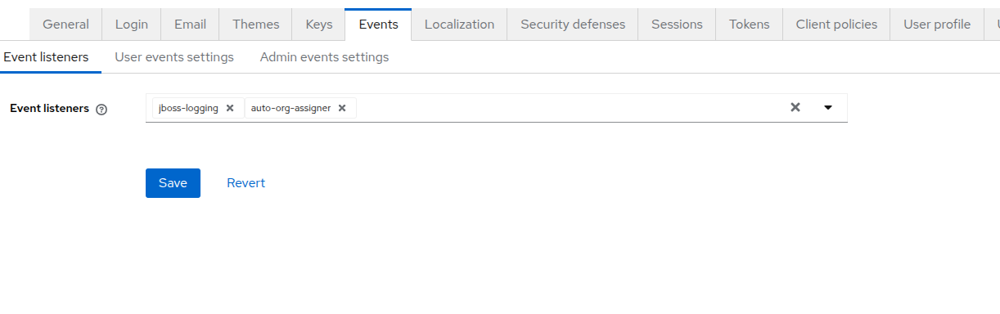

# Keycloak Organization auto-assigner

This is a Keycloak custom SPI that automatically assigns users to organizations based on their email domain.

Starting from Keycloak 26, `Organizations` are fully supported in Keycloak. This SPI allows you to automatically assign users to organizations based on their email domain, making it easier to manage user access and permissions.


## Compilation

There is a `Dockerfile` in the root of the project that can be used to build a Docker image with the SPI:

```bash
docker build -t keycloak-organization-auto-assigner .
```

The compiled JAR file will be located in `/usr/src/app/target/keycloak-auto-org-assigner-1.0.0.jar`:

```bash
docker create --name keycloak-organization-auto-assigner keycloak-organization-auto-assigner
docker cp keycloak-organization-auto-assigner:/usr/src/app/target/keycloak-auto-org-assigner-1.0.0.jar dist/keycloak-auto-org-assigner-1.0.0.jar
docker rm keycloak-organization-auto-assigner
```


## Deployment

Copy the JAR file to your Keycloak server's `providers/` directory.


## Configuration

1. Log in to the Keycloak Admin Console.
2. Select the Realm where you want to configure the SPI.
3. Navigate to **Realm Settings** > **Events** > **Event Listeners**.
4. Find the `auto-org-assigner` listener in the "Available" list and select it.


